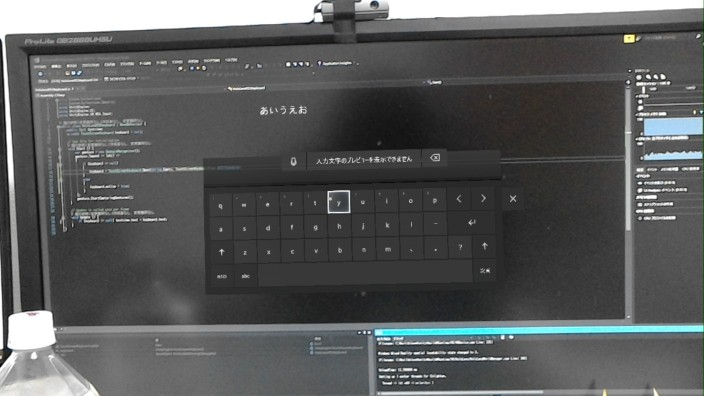

# HoloLensRS5Keyboard-Unity

**HoloLens RS5は2018/08/26現在ではプレビュー版であり，正式版では変更，削除されている場合があります．**

## 概要
HoloLensRS5からUnity内で利用可能になったソフトウェアキーボードのサンプルです．

## 動作環境
- Unity 2017.4.8f1
- VisualStudio 2017
- HoloLens RS5 (10.0.17720.1000)

## 説明
HoloLens RS4まではUnity内でソフトウェアキーボードを利用する場合には以下の方法がありました．

- MixedRealityToolkit(MRTK)キーボードを利用する 
    + [https://github.com/Microsoft/MixedRealityToolkit-Unity](https://github.com/Microsoft/MixedRealityToolkit-Unity)
- UWPビルドのBuild TypeをXAML形式に変更してXAML2Dパネルから入力を行う   
    + [http://littlewing.hatenablog.com/entry/2017/03/03/164645](http://littlewing.hatenablog.com/entry/2017/03/03/164645)
- 自前で実装を行う

しかし
- 予測変換させたい
- XAML遷移したくない
- 手間はかけたくない
- 日本語に対応させたい
- 音声認識入力も使いたい

など要望が出てきます．

HoloLensの次期バージョンアップ，RS5では3D空間でもソフトウェアキーボードが表示されるようになりました．
またHoloLens RS5から対応言語に日本語と中国が追加され，日本語IME，音声認識が利用できるようにもなっています．
UnityからはTouchScreenKeyboardから利用が可能になります．

## Unity設定
### Build設定
- PlatformはUniversal Windows Platform
- Build TypeはD3D，XAML両方で利用可能
- PlayerSettings/Other Settings/Scripting BackendはIL2CPP，.NET両方で利用可能

### TouchScreenKeyboard解説
`TouchScreenKeyboard.Open(string text)`でソフトウェアキーボードが利用できます．

`TouchScreenKeyboard.Open()`にはパラメーターがありますが，HoloLens RS5のキーボードでは以下ようになっています．
- `TouchScreenKeyboardType`を変更しても入力キーボードは変更されない
- `autocorrection,multiline,secure,alert`フラグを変更しても入力キーボードは変更されない

### サンプル実行
- AirTapでキーボードが起動

## 参考資料
- UnityのTouchScreenKeyboardのページ [https://docs.unity3d.com/ja/current/ScriptReference/TouchScreenKeyboard.html](https://docs.unity3d.com/ja/current/ScriptReference/TouchScreenKeyboard.html)
- MicrosoftのHoloLensのUnity内でキーボードを使う方法 [https://docs.microsoft.com/en-us/windows/mixed-reality/keyboard-input-in-unity](https://docs.microsoft.com/en-us/windows/mixed-reality/keyboard-input-in-unity)
- HoloLens RS5の新機能を紹介しているリリースノート [https://docs.microsoft.com/en-us/hololens/hololens-insider](https://docs.microsoft.com/en-us/hololens/hololens-insider)